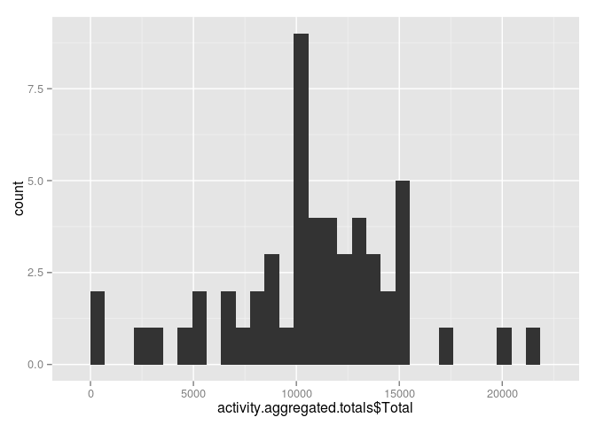
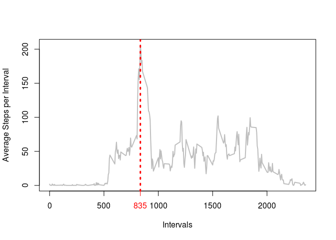
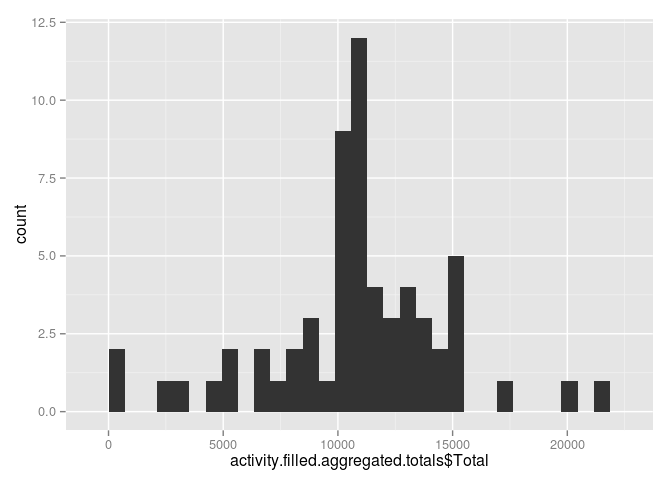
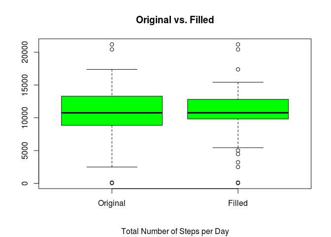

Reproducible Research (Peer Assessment 1)
===========================================

Author: Nikos Alexandris, August 2014

## Loading the data

Reading the csv data file


```r
activity <- read.csv("~/archive/coursera/Reproducible_Research/Peer_Assessment_1/activity.csv", stringsAsFactors=FALSE)
```

Checking class & structure of imported data


```r
class(activity)
```

```
## [1] "data.frame"
```

```r
str(activity)
```

```
## 'data.frame':	17568 obs. of  3 variables:
##  $ steps   : int  NA NA NA NA NA NA NA NA NA NA ...
##  $ date    : chr  "2012-10-01" "2012-10-01" "2012-10-01" "2012-10-01" ...
##  $ interval: int  0 5 10 15 20 25 30 35 40 45 ...
```

Summarising


```r
summary(activity)
```

```
##      steps           date              interval   
##  Min.   :  0.0   Length:17568       Min.   :   0  
##  1st Qu.:  0.0   Class :character   1st Qu.: 589  
##  Median :  0.0   Mode  :character   Median :1178  
##  Mean   : 37.4                      Mean   :1178  
##  3rd Qu.: 12.0                      3rd Qu.:1766  
##  Max.   :806.0                      Max.   :2355  
##  NA's   :2304
```

Summarise data after *NAs omission*


```r
activity.nonas <- na.omit(activity)
summary(activity.nonas)
```

```
##      steps           date              interval   
##  Min.   :  0.0   Length:15264       Min.   :   0  
##  1st Qu.:  0.0   Class :character   1st Qu.: 589  
##  Median :  0.0   Mode  :character   Median :1178  
##  Mean   : 37.4                      Mean   :1178  
##  3rd Qu.: 12.0                      3rd Qu.:1766  
##  Max.   :806.0                      Max.   :2355
```

* * *

## What is mean total number of steps taken per day?

**1. Histogram of the total number of steps per day**

Firstly, we derive the total steps per day


```r
activity.aggregated.totals <- aggregate(activity$steps, list (activity$date), FUN = "sum")
colnames(activity.aggregated.totals) <- c ("Date", "Total")
```


Then, we may obtain the requested histogram via


```r
require(ggplot2)
```

```
## Loading required package: ggplot2
```

```r
qplot(activity.aggregated.totals$Total)
```

```
## stat_bin: binwidth defaulted to range/30. Use 'binwidth = x' to adjust this.
```

 

**2. Mean and Median of the total number of steps per day**

To derive descriptive parameters, we summarise the aggregated data,


```r
summary(activity.aggregated.totals)
```

```
##      Date               Total      
##  Length:61          Min.   :   41  
##  Class :character   1st Qu.: 8841  
##  Mode  :character   Median :10765  
##                     Mean   :10766  
##                     3rd Qu.:13294  
##                     Max.   :21194  
##                     NA's   :8
```

The *mean* and *median* of the total number of steps per day, are **10766** and **10765** respectively as extracted from the ```summary()``` report shown above.


* * *

## What is the average daily activity pattern?

**1. Time series plot (i.e. type = "l") of the 5-minute interval (x-axis) and the average number of steps taken, averaged across all days (y-axis)**


```r
require(plyr)
```

```
## Loading required package: plyr
```

```r
activity.nonas.intervals <- ddply (activity.nonas, .(interval), summarize, Total = sum (steps), Mean = mean (steps))
plot ( activity.nonas.intervals$interval, activity.nonas.intervals$Mean, type = "l", xlab = "Intervals", ylab = "Average Steps per Interval")
```

 

**2. The 5-minute interval, on average across all the days in the dataset, which contains the maximum number of steps,** can be retrieved via


```r
interval.max.row <- which.max (activity.nonas.intervals$Mean)
interval.max <- activity.nonas.intervals[interval.max.row, "interval"];
```

and is


```r
interval.max
```

```
## [1] 835
```

A plot that depicts visually the above finding, can be obtained via the following instructions:


```r
plot ( activity.nonas.intervals$interval, activity.nonas.intervals$Mean, type = "l", xlab = "Intervals", ylab = "Average Steps per Interval", lwd=2, col = "gray")
abline(v=activity.nonas.intervals$interval[interval.max.row], col="red", xlab = "104", lty = 3, lwd=3)
axis(1, at=interval.max, col = "red", col.axis = "red")
```

 


* * *

## Imputing missing values

**1. Total number of missing values in the dataset**, i.e. the total number of rows with NAs, is **2304** as retrieved by ```summary(activity$steps)```


```
##    Min. 1st Qu.  Median    Mean 3rd Qu.    Max.    NA's 
##     0.0     0.0     0.0    37.4    12.0   806.0    2304
```

**2. Filling missing values in the dataset** | *Simple approach, source: <http://www.mail-archive.com/r-help@r-project.org/msg58289.html>*


```r
impute <- function (x, fun) {
missing <- is.na(x)
replace ( x, missing, fun (x[!missing]))
}
activity.filled <- ddply(activity, ~interval, transform, steps = impute(steps, mean))
```

3. **Histogram, mean and median of the total number of steps per day**

As in *question 2*, we derive the total steps per day


```r
activity.filled.aggregated.totals <- aggregate(activity.filled$steps, list (activity.filled$date), FUN = "sum")
colnames(activity.filled.aggregated.totals) <- c ("Date", "Total")
```


Then, we may obtain the requested histogram via


```r
require(ggplot2)
qplot(activity.filled.aggregated.totals$Total)
```

```
## stat_bin: binwidth defaulted to range/30. Use 'binwidth = x' to adjust this.
```

 

Next, we derive the *mean* and *median* values of the total number of steps per day


```r
require(plyr)
activity.filled.ddply <- ddply(activity.filled, .(date), summarize, Totals=sum(steps), Mean=mean(steps))
summary(activity.filled.ddply)
```

```
##      date               Totals           Mean      
##  Length:61          Min.   :   41   Min.   : 0.14  
##  Class :character   1st Qu.: 9819   1st Qu.:34.09  
##  Mode  :character   Median :10766   Median :37.38  
##                     Mean   :10766   Mean   :37.38  
##                     3rd Qu.:12811   3rd Qu.:44.48  
##                     Max.   :21194   Max.   :73.59
```
From the ```summary()``` tables shown above, the requested values are identical and equal to **10766**.

**Original vs. Filled-in Data**

The *mean* value is identical to the one of the original data set. The *median* has been equalised to the *mean* and differs only slightly from the original one (i.e. now **10766** vs. **10765**).  The impact of imputing missing data on the estimates of the total daily number of steps, using a very simple (simplistic?) approach, is minimal as the distribution has not been altered strongly.  

The effect of this simple fill-in approach, can be seen in a comparison box-plot of the *original* total number of steps per day (including missing observations) versus the *filled* values.

First we combine the vectors of interest in a new data.frame,


```r
original.vs.filled <- cbind(activity.aggregated.totals, activity.filled.aggregated.totals$Total)
colnames(original.vs.filled) <- c ("Date", "Original", "Filled")
```

and then we can box-plot them all in once step:

```r
boxplot(original.vs.filled[,-1], main = "Original vs. Filled", sub = "Total Number of Steps per Day", col = "green")
```

 
* * *

## Are there differences in activity patterns between weekdays and weekends?

**1. New factor variable in the dataset with two levels -- "weekday" and "weekend" indicating whether a given date is a weekday or weekend day**


```r
activity.filled$Day <- format ( as.POSIXct ( activity.filled$date), "%A" )
activity.filled[!activity.filled$Day %in% c('Saturday', 'Sunday'),]$Day <- 'weekday'
activity.filled[activity.filled$Day %in% c('Saturday', 'Sunday'),]$Day <- 'weekend'
activity.filled$Day <-as.factor(activity.filled$Day)
```

**2. A panel plot containing a time series plot (i.e. type = "l") of the 5-minute interval (x-axis) and the average number of steps taken, averaged across all weekday days or weekend days (y-axis).**


```r
require(lattice)
```

```
## Loading required package: lattice
```

```r
xyplot(steps ~ interval | Day, data=activity.filled, layout = c (1,2), panel = function(x, y, ...) {
  panel.xyplot(x, y, type = "l")
  panel.abline(h = mean(y), lty = 2, col = "red")
})
```

 
